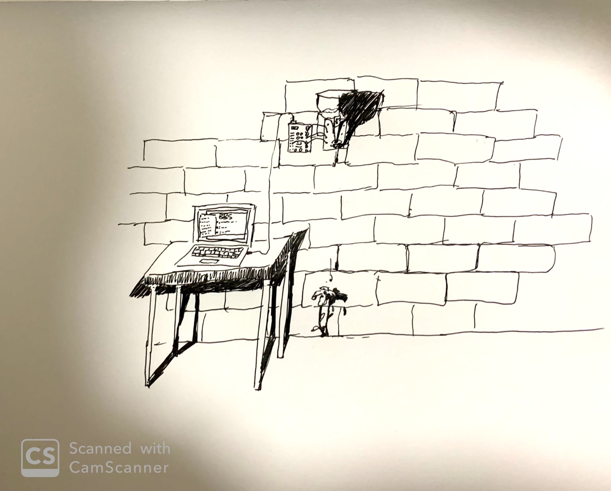

# Hacker Ethic Discussion under the Sun, work in progress

- Date: April 22, 2020
- Medium: Digital Image file 
- Description: This is scanned sketch of my installation idea. 

- Date: April 5, 2020
- Medium: URL link
- Description: This is the art work of AAAJIAO that i got my inspiration from. 

Inspired by one of the most popular Chinese new media artist AAAJIAO's work:Water Measure-petroleum. Where a programmed hourglass filled with petroleum-like pitch-black water. Every drip of water reads the binary coded redundant data filtered from high-frequency trading. This way of representing informations really inspired me. So I decided to create a installation that use an arbuino while it's connected to my computer to create an plants irrigation system that does automatic watering to the flower growing out of the wall, everytime someone make a comment in the discussion over the hacker ethic issue pn my computer. Using both the irrigation system and the growing of the flower to visully document the progress people made on the issue of redefining hacker ethic. Also, having the flower growing out of a wall as a poetic symbolization to represent the hopefullness of the true Hacker Ethic and the Hacker Culture is my main goal to achieve in this installation piece. 
